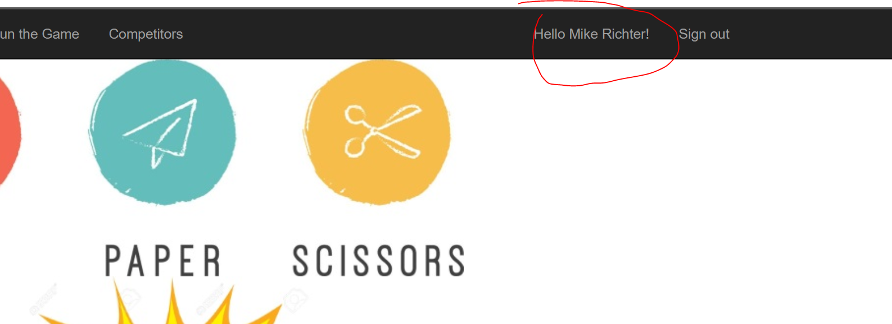

# Challenge 6 - Implement Azure AD B2C

## Prerequisities

1. [Challenge 4 - Run the app on Azure](./RunOnAzure.md) should be done successfully.

## Introduction

Right now your application on Azure is wide open for anyone to use. Your application allows you to add, edit and delete competitors. Let's make sure only authenticated users can do this. If you try to perform one of these actions in your application, you'll get some errors; you need to complete the feature! 

The application has the code in place to authenticate users against Azure AD B2C, you just need to create an Azure AD B2C application, build the user journeys and policy and then set the right configuration values.

## Challenges

1. Create an `Azure AD B2C` application in the Azure portal.
1. Allow users to authenticate with a `Microsoft Account`.
1. Make sure it works in your dev environment AND on Azure!

## Success criteria

1. When a user hits the 'Sign In' link, they are redirected to login with a Microsoft Account.
1. A user can successfully authenticate with an MSA, get redirected back to your application and see a personalized greeting (see below).

3. A user can successfully add or edit a bot in the Competitor views.
1. In Azure DevOps (Boards), from the Boards view, you could now drag and drop the user story associated to this Challenge to the `Resolved` or `Closed` column, congrats! ;)

## Tips

* Make sure you are calling the application with https (locally and in Azure) for the authentication redirects to work.
* Remember to keep your configuration secrets OUT of your code or config files. 
* If you can't find your AAD B2C Azure resources after you create them, make sure you switch AAD Tenants in the Azure portal.
## Advanced challenges

Too comfortable? Eager to do more? Try this:
* Allow users to authenticate with more than 1 Identity Provider. Try it with Facebook and LinkedIn too.
* Rather than relying on users to use their social logins, let them create their own accounts in your tenant.

## Learning resources

* [Set up AAD B2C with a Microsoft Account](https://docs.microsoft.com/en-us/azure/active-directory-b2c/active-directory-b2c-setup-msa-app) - In step 6, you may to format the Redirect URL as: `https://login.microsoftonline.com/te/<your-tenant>.onmicrosoft.com/oauth2/authresp`

[Next challenge (FIXME) >](./)